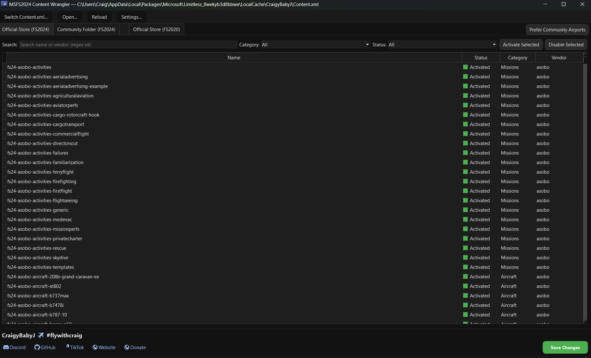
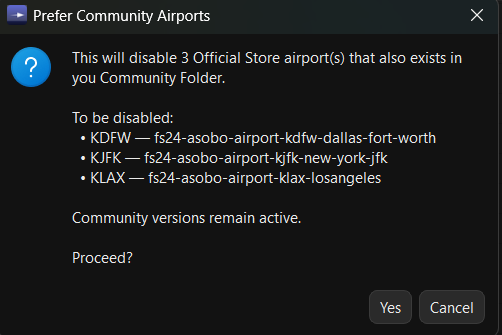
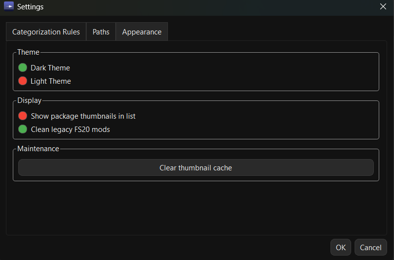

# MSFS Content Wrangler

## Screenshots

| Main window | Prefer Community Airports | Settings & thumbnails |
|---|---|---|
|  |  |  |

## ✈️ Your Essential Tool for Microsoft Flight Simulator Content Management

The **MSFS Content Wrangler** is a fast, user-friendly desktop application designed to help you effortlessly manage your Microsoft Flight Simulator (MSFS) content. **Please note: This tool is currently suitable only for the Microsoft Store (Xbox) version of MSFS.** It provides a clear overview of your installed packages, allowing you to easily activate, disable, and organize your add-ons.

---

### ✨ Key Features at a Glance

*   **Comprehensive Content Overview:**
    *   Loads your `Content.xml` file and displays all installed entries in a clean, sortable table.
    *   View essential details: Name, Status, Category, Vendor, and an optional Thumbnail.
    *   Dedicated tabs for:
        *   **Official Store (MSFS 2024):** Content from the official marketplace.
        *   **Community Folder (MSFS 2024):** Your community-installed add-ons.
        *   **Official Store (MSFS 2020):** Legacy content from the MSFS 2020 marketplace.

*   **Effortless Package Management:**
    *   **Toggle Status:** Easily switch packages between `Activated` and `UserDisabled` by clicking the **Status button** in any row, or use the "Activate Selected" and "Disable Selected" buttons for batch operations.
    *   `SystemDisabled` entries are read-only and visually muted, ensuring you don't accidentally modify critical files.
    *   **Multi-Selection:** Use Shift-click and Ctrl/Cmd-click for convenient multi-selection (SystemDisabled rows are automatically excluded).

*   **Smart Filtering & Search:**
    *   Quickly find what you need: Search by name or vendor (supports regular expressions!), and filter by Category or Status using the dropdowns above the list.
    *   Sort any column to organize your view.

*   **Intelligent Thumbnail Discovery:**
    *   The Wrangler discovers and displays package thumbnails directly from their installed locations, without duplicating files.
    *   Thumbnails are cached for fast loading.
    *   **Refresh Options:**
        *   Right-click any row and select "Refresh thumbnail(s)" to re-scan.
        *   Clear the entire thumbnail cache via the **Settings** dialog to rebuild it from scratch.
    *   Shows a clear "Not Found" tile if no image is detected.

*   **Safe & Secure Operations:**
    *   **Backup on Save:** Before applying changes, the app creates a backup copy of your `Content.xml` (for example, `Content_backup.xml`) alongside the original so you can revert if needed.
    *   **Optional Cleanup:** Configure the tool to optionally remove legacy MSFS 2020 Community entries during save, helping to keep your `Content.xml` tidy.

*   **New! Prefer Community Airports:**
    *   This powerful feature helps you manage duplicate airport entries.
    *   Click the "Prefer Community Airports" button to automatically disable Official Store airports (both MSFS 2024 and MSFS 2020) if a matching airport exists in your MSFS 2024 Community Folder.
    *   Community versions remain active, and changes are staged until you click "Save".

*   **Quality of Life Enhancements:**
    *   **Modern UI:** A completely rewritten C# WPF application with a custom dark/light theme and acrylic effects.
    *   **Toolbar Access:** Quick access to Open, Switch Content.xml, Reload, and Settings directly from the top toolbar.
    *   **Non-blocking:** Background processes keep the UI responsive while loading thumbnails or processing data.

---

### 🚀 Quick Start

1.  **Launch the App:** The Wrangler will attempt to auto-detect your `Content.xml` file.
2.  **Select Content.xml:** If not auto-detected, use the **Open...** or **Switch Content.xml** buttons in the toolbar to manually select it.
3.  **Explore Tabs:** Navigate through the "Official Store (FS2024)", "Community Folder (FS2024)", and "Official Store (FS2020)" tabs.
4.  **Manage Packages:**
    *   Click the **Status button** in any row to toggle that package.
    *   Select multiple rows and use **Activate Selected** or **Disable Selected** buttons at the top of the tab.
    *   Try the **Prefer Community Airports** button to streamline your airport add-ons.
5.  **Save Changes:** Click the **Save** button (bottom right) to apply your modifications. A backup will be created automatically.

---

### 🧩 How It Works (Technical Overview)

*   **Content Discovery:** On first launch, the app scans common MSFS LocalCache locations for `Content.xml`. You can switch files anytime. The table is backed by `PackageRow` objects, representing each entry.
*   **Tab Filtering:** Tabs are enforced by a filter layer that displays content based on `source` (official/community) and `sim` (fs24/fs20) tags.
*   **Thumbnails (Map-Only Cache):** The app never copies or resizes images. It stores paths in `cache/thumbnails.json`, keyed by package name, including resolved image paths and modification times for validation. Thumbnail discovery runs asynchronously to maintain UI responsiveness.
*   **Status Toggling:** Clicking the Status button or using bulk buttons updates the package status. `SystemDisabled` entries are protected.
*   **Save & Backup:** Before writing, a timestamped backup of `Content.xml` is created. The "Clean legacy FS20 mods" option (configurable in Settings) removes old MSFS 2020 Community references during save.

---

### 🧪 Power User Notes

*   **Regex Search:** The search bar supports regular expressions for precise filtering across name and vendor fields.
*   **Selection Behavior:** Shift-click for range selection; Ctrl/Cmd-click to add/remove individual items. `SystemDisabled` rows will not remain selected in mixed groups.
*   **Performance:** Thumbnail discovery is threaded and throttled, and the cache prevents redundant scanning on subsequent launches.
*   **Safety:** Only `Content.xml` is modified; no package folders are touched. Backups are always created.
*   **Right-click Menu:** Provides quick access to "Refresh thumbnail(s)" for selected rows.

---

### 🐞 Troubleshooting

*   **No thumbnails appear:**
    *   Ensure **Settings** → **Appearance** → **Show package thumbnails in list** is enabled.
    *   Use **Clear thumbnail cache** in Settings and scroll; rows will be re-scanned.
    *   Verify packages contain `ContentInfo/thumbnail*.{png|jpg|jpeg|webp}` or `layout.json` references.
*   **"Permission denied" when saving thumbnail cache:**
    *   Your antivirus or another process might be locking `cache/thumbnails.json`. Add an exclusion for the app folder.
*   **`Content.xml` not found:**
    *   Manually open it via the **Open...** button and select the correct profile’s `Content.xml`.
*   **MSFS 2020 Community items are missing:**
    *   By design, this tool hides MSFS 2020 Community entries to prevent cross-sim confusion.
    *   If `Clean legacy FS20 mods` is enabled in Settings, these references are removed on save.

---

### 🤝 Contributing

PRs and issues are welcome! If you're filing a bug, please include:
*   Whether MSFS 2024/2020 are installed and from which store (MS Store/Steam)
*   `Content.xml` location
*   Steps to reproduce

---

### 📄 License

MIT. See [LICENSE](LICENSE)

---

### 🙏 Credits

Built with ❤️ by @CraigyBabyJ and contributors.

*Not affiliated with Microsoft, Asobo Studio, or any add-on vendor. All product names, logos, and brands are property of their respective owners.*
